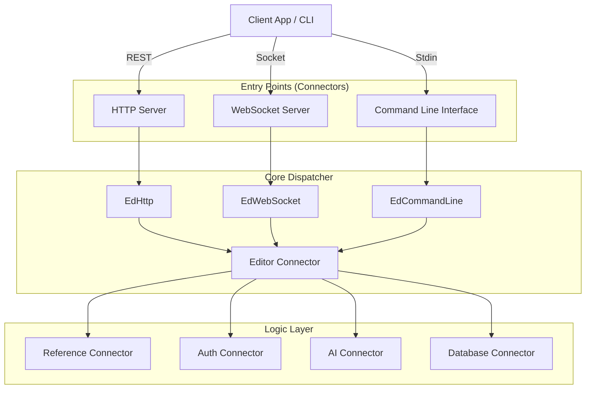

# AWI Server Documentation

> **⚠️ IMPORTANT:** Before proceeding, read [ABSOLUTE_ORDERS.md](./ABSOLUTE_ORDERS.md) for critical protocols regarding crashes and debugging.

> **⚠️ IMPORTANT:** Before proceeding, read [ABSOLUTE_ORDERS.md](./ABSOLUTE_ORDERS.md) for critical protocols regarding crashes and debugging.

## 1. System Overview & Philosophy

The **AWI (Artificial Wisdom Intelligence)** Server is a modular, event-driven engine designed to power intelligent applications. Its core philosophy is based on a **"Triple-Entry" Architecture**, allowing the same business logic to be accessed seamlessly via:
1.  **HTTP/REST**: For standard web clients.
2.  **WebSocket**: For real-time, stateful interactions.
3.  **Command Line**: For local administration and testing.

The system is built to be **extensible** (via Connectors) and **resilient** (via a standardized `Answer` protocol that replaces traditional exception handling for business logic).

### Architectural Diagram


---

## 2. Core Framework Classes

The system relies on a strict class hierarchy to ensure consistency.

### 2.1. `Awi` (`awi.mjs`)
The central engine instance.
*   **Responsibilities**: Bootstrapping, loading connectors, configuration management, and providing global access to system utilities.
*   **Key Members**:
    *   `this.connectors`: Registry of loaded connectors.
    *   `this.bubbles/memories/souvenirs`: Registry of agentic components.
    *   `connect(options)`: Initializes the system.
    *   `log(message, params)`: Centralized logging with verbosity control.

### 2.2. `Base` (`base.mjs`)
The root class for all system objects.
*   **Responsibilities**: Standardization of object identity and response creation.
*   **Key Methods**:
    *   `newAnswer(data)`: Creates a success response.
    *   `newError(definition)`: Creates an error response.
    *   `sanitizeForJson(obj)`: Cleans circular references for safe logging.

### 2.3. `ConnectorBase` (`connector.mjs`)
Base class for all functional modules.
*   **Attributes**: `name`, `token` (internal ID), `group` (namespace), `priority`.
*   **Lifecycle**: `connect()` -> `setConnected(bool)` -> `quit()`.

---

## 3. Communication Protocol: The `Answer` Class

One of AWI's most distinct features is its refusal to use `try/catch` for control flow in business logic. Instead, it uses the `Answer` class (`answer.mjs`).

### 3.1. Structure
An `Answer` object contains:
*   `success` (boolean): `!error && !warning`.
*   `data` (any): The payload.
*   `message` (string): Human-readable status or error key (e.g., `'awi:user-not-found'`).
*   `type` (string): Data type descriptor.

### 3.2. Propagation Strategy
Errors originate at the source (e.g., a database query failure) and bubble up through the return values, not exceptions.

**Example Pattern:**
```javascript
// Database Layer
async queryRecord() {
    if (!db) return this.newError({ message: 'db:not-connected' });
    // ...
    return this.newAnswer(record);
}

// Logic Layer
async getUser() {
    var answer = await this.database.queryRecord();
    if (answer.isError()) return answer; // Pass it up immediately
    // Process data...
    return this.newAnswer(processedData);
}

// Entry Point (e.g., EdHttp.mjs)
async onMessage(msg) {
    var answer = await this.logic.getUser();
    if (answer.isSuccess()) return ok(res, answer.data);
    return fail(res, answer.message); // Log and reply 400/500
}
```

**Benefits**:
*   Clean stack traces.
*   Predictable control flow.
*   Type-safe responses.

---

## 4. Routing & Dispatch System

### 4.1. Network Entry
1.  **HTTP Server** (`connectors/network/httpserver.mjs`):
    *   Uses Express.
    *   Handles multipart uploads via `multer`.
    *   Special `chunk-upload` route reassembles large files before passing to the logic layer.
    *   **Normalization**: Converts `req.body` or `req.query` into a standard Message Object.
    *   **Static Serving**: Serves the frontend application from the configured root.

2.  **WebSocket Server** (`connectors/network/websocketserver.mjs`):
    *   Uses `ws`.
    *   **Chunking**: Implements a custom protocol for handling large binary payloads over WS (metadata header -> chunks -> reassembly).
    *   **Session**: Maps WS connections to User Sessions.

### 4.2. Editor Dispatcher (`connectors/editor/`)
This layer normalizes the interface between the network and the code.
*   `Editor` (`editor.mjs`): Manages active editor instances.
*   `EdNetwork` (`ed-network.mjs`): Base class for network-based interaction.
*   `EdHttp` / `EdWebSocket`: Specific implementations that know how to "Reply" to their respective clients (JSON response vs WS frame).

### 4.3. Message Processing
When a message arrives, `onMessage(message)` is called on the appropriate Editor instance.
1.  **Authentication**: Validates `supabaseTokens` via `awi.authentification`.
2.  **Command Lookup**:
    *   Checks for `command_[COMMAND_NAME]` method on the Editor.
    *   If missing, parses `connector:function` string (e.g., `thinknotes:uploadAudio`).
    *   Delegates to `awi.connectors[connector].commands[function]`.

---

## 5. Agentic Architecture (Future/Legacy)

The `bubbles`, `memories`, and `souvenirs` directories implement a data-flow programming model intended for future AI agency.

### 5.1. Concepts
*   **Bubble** (`bubble.mjs`): An atomic unit of execution. It has `inputs`, `outputs`, and `exits` (success/error paths).
*   **Branch** (`branch.mjs`): A tree of Bubbles. It manages execution flow ("up" or "down" the tree).
*   **Memory** (`memory.mjs`): A persistent store of information, structured as a graph.
*   **Souvenir** (`souvenir.mjs`): A specific recallable item within a Memory (e.g., a Photo, a Conversation).

### 5.2. The "Basket"
A context object passed through the execution chain.
*   **Role**: Holds state, variables, and accumulated data during a Bubble execution flow.
*   **Utilities**: `awi.utilities.getArgs` is used heavily to resolve function arguments from either direct parameters or the Basket.

---

## 6. Utilities & Helpers

### 6.1. ConnectorUtilities (`connectors/awi/utilities.mjs`)
A massive toolkit for the engine.
*   **Serialization**: `serializeIn` / `serializeOut` for saving/loading object graphs (Bubbles/Memories).
*   **Encryption**: `encrypt` / `decrypt` (XOR + Base64) for basic obfuscation.
*   **IDs**: `getUniqueIdentifier` generates collision-resistant IDs based on timestamps and randomness.
*   **Type Checking**: `isObject`, `isArray`, `isFunction` helpers.

### 6.2. ConnectorMessages (`connectors/awi/messages.mjs`)
Handles system text and localization.
*   **Format**: `awi:message-key`.
*   **Substitution**: Supports variable injection (e.g., `~{userName}~`).
*   **Fallback**: Returns formatted error strings if keys are missing.

---

## 7. Server Commands (`servercommands.mjs`)
This file acts as the **API Contract**. It maps string constants to command names.
*   **Example**: `UPLOAD_AUDIO: 'thinknotes:uploadAudio'`
*   **Usage**: Clients send the constant value; the Server routing maps `thinknotes` to the connector and `uploadAudio` to the function.

---

## 8. Developer Guide

### Adding a New Connector
1.  Create `connectors/mygroup/myconnector.mjs`.
2.  Extend `ConnectorBase`.
3.  Define `this.name`, `this.token` (e.g., `'myconn'`).
4.  Implement `connect(options)`.
5.  Add commands in a `commands` object or as methods.
6.  Register in `linux-node-prompt.mjs` config array.

### Adding a New Route
1.  Add the command key to `servercommands.mjs`.
2.  Implement the function in your Connector.
    ```javascript
    async command_myFunction(parameters, message, editor) {
        // 1. Validation
        if (!parameters.data) return this.newError({ message: 'missing-data' });
        
        // 2. Logic
        var result = await doSomething(parameters.data);
        
        // 3. Response
        // Always use replySuccess/replyError.
        // - If called via REST/WS (message/editor present): Sends response to client.
        // - If called directly (no message/editor): Returns the Answer object.
        var answer = this.newAnswer({ result });
        return this.replySuccess(answer, message, editor);
    }
    ```

### 3. Dual-Level Response System
The `newAnswer` / `newError` system operates at two levels to ensure commands are reusable:
1.  **Direct Call**: When a command is called directly from another connector (where `message` and `editor` are `undefined`), the system detects this context and returns the original `Answer` object. This gives the caller full programmatic control over the result.
2.  **Routed Call**: When called via REST or WebSocket (where `message` and `editor` are provided), `replySuccess` and `replyError` automatically format the `Answer` into the appropriate network response (JSON or WS frame) and send it to the client.

**Rule**: Inside `command_*` methods, **always** use `this.replySuccess(answer, message, editor)` or `this.replyError(answer, message, editor)`. This ensures the command works correctly in both direct and networked contexts without extra conditional logic.
